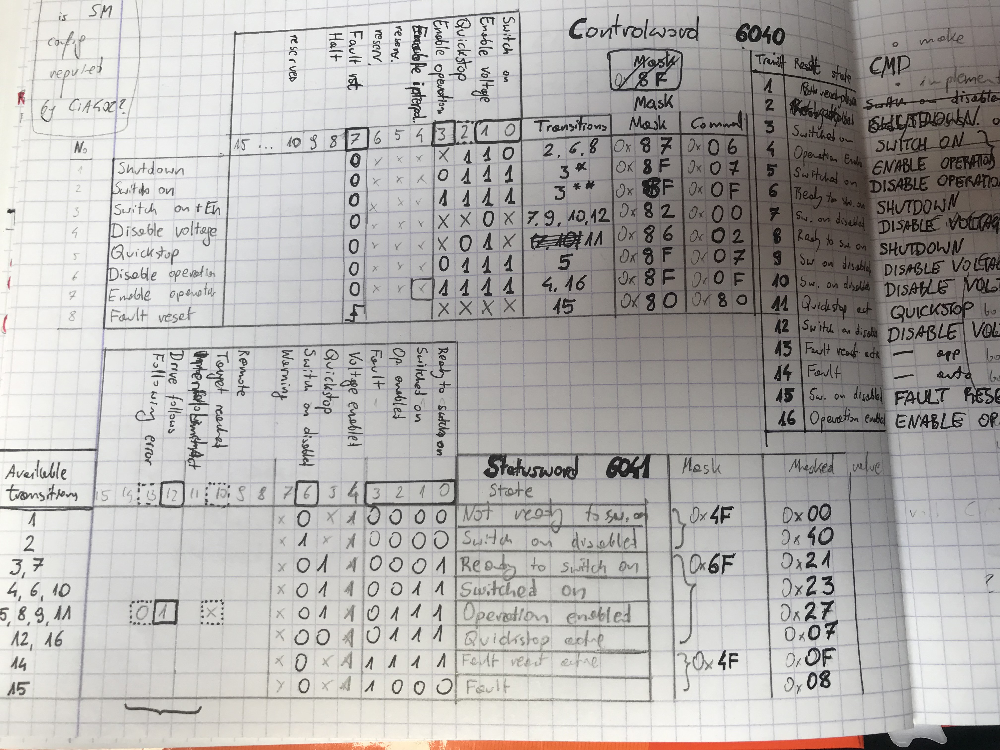

# LAN9252-SPI with SOES

Luckily SOES has HAL file for LAN9252 with SPI, only SPI config, read and write need to be implemented.
[TODO] link project
And we have example application running on our device. Great.

# Speed benchmarking

We already know PDOs size. RxPDO (command from master to servodrive) will be uint16_t controlword + uint32_t position command, TxPDO (feedback from our servo device) is the same size: uint16_t statusword, uint32_t position actual, so it is 6 bytes in, 6 bytes out. We can set it in EasyCAT and see how long does it take to cycle. Then we can do tweak PDOs in SOES project, and test speed the same way.

TODO paste benchmark results

Results are... not great for LAN9252 with CoE stack. It was okay with EasyCAT library, but something with SOES setup makes it much slower, and to make things worse timing is not consistent. Considering app notes from Microchip on measuring cycle time (with Slave Stack Code from Beckhoff) this should look way better, and deserves proper investigation... but as always there have more urgent things to do.

# CiA402 profile implementation

First step is to get CiA 402 state machine diagram, for example from datasheet of servodrive that implements it [(Hiwin has it described well)](https://hiwin.us/wp-content/uploads/ethercat_drive_user_guide.pdf) . From this we can calculate commandword masks, command codes for each transition, statusword masks and status codes for each state. Here goes resulting transition table:

Then just retype these codes into .c header, connect it to get state machine code, wire it with object dictionary, set correct `ProductCode="#x00020192"` (0x192 is 402d, CiA402 profile code)... Oh, and add dummy motion control application: loopback `Obj.Position_actual = Obj.Target_position;`

[TODO] link project

Now we are ready to test. For that create new TwinCAT project, add point to point motion control with single axis, scan for boxes and select our new device in axis settings

[TODO] prepare LICEcap gif

And after some tweaks, it is working. Our dummy servo reports that it went exactly where controller wanted it to go.

[Next: LAN9252 PCB rev 2](https://kubabuda.github.io/ecat_servo/005-lan9252-rev2)
[Back to the table of contents](https://kubabuda.github.io/ecat_servo)
