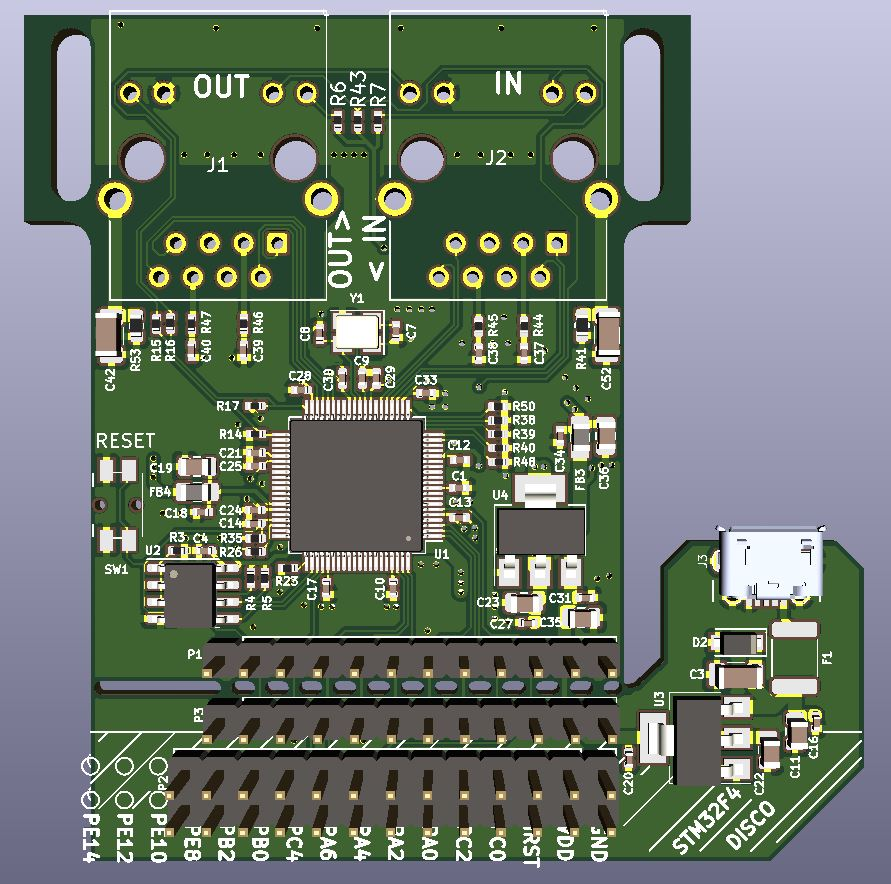
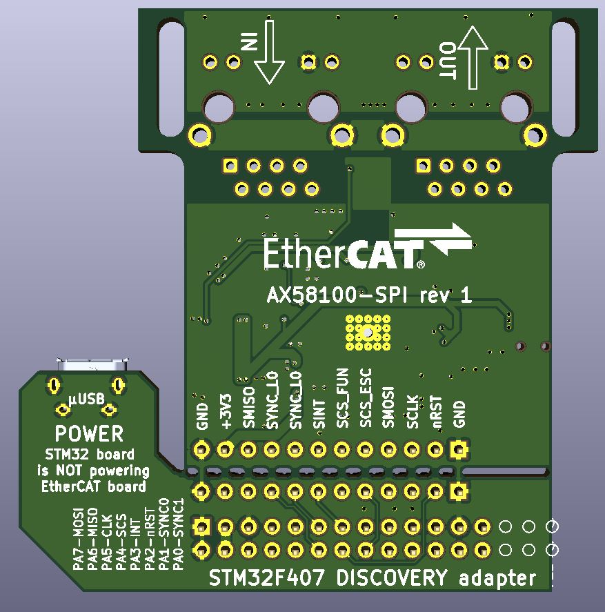
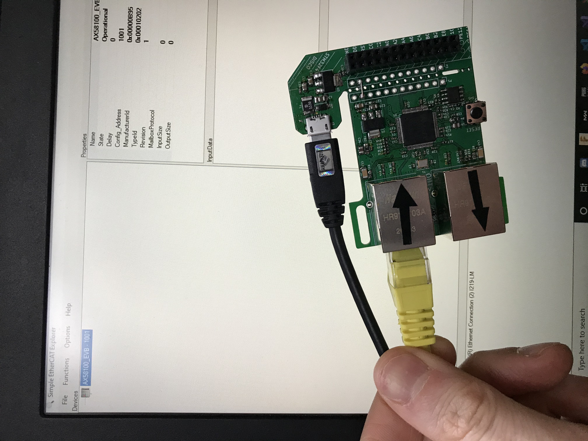
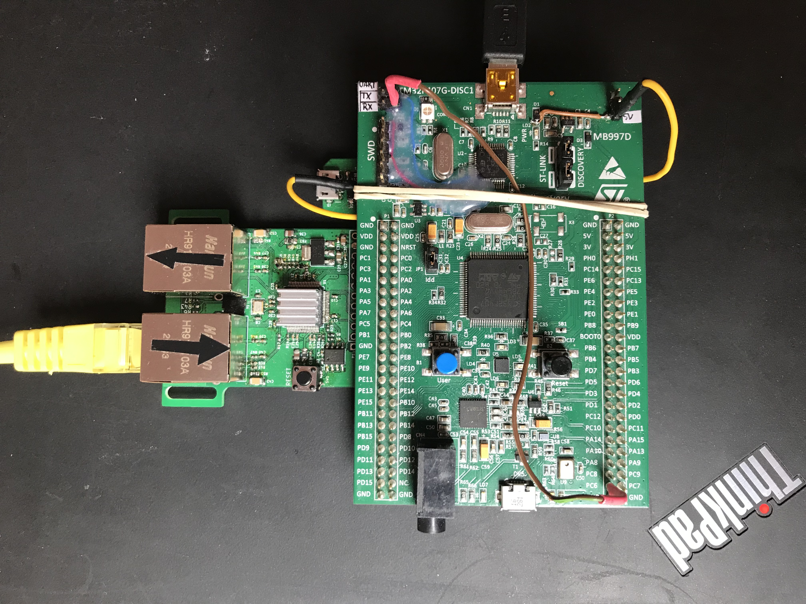
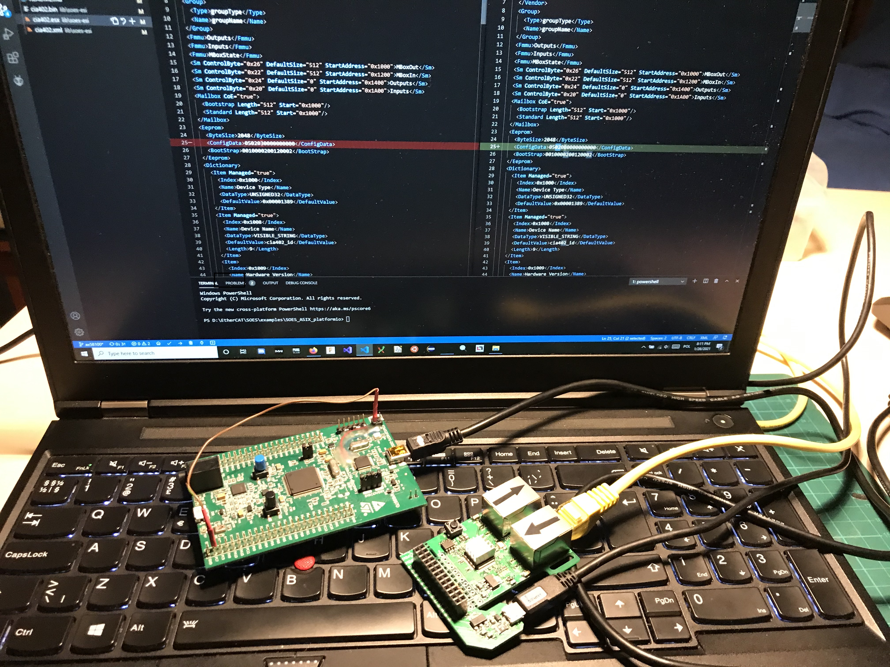

# AX58100 

## Board design

LAN9252 indirect register addressing is complex ... frankly it feels cumbersome, building DMA for that is going to be super messy and not that efficient either. The original ESC from Beckhoff, ET1100, was much more straigtforward to work with. To see the difference, just compare SOES HAL files for [ET1100](https://github.com/OpenEtherCATsociety/SOES/blob/master/soes/hal/rt-kernel-twrk60/esc_hw.c) vs [LAN9252](https://github.com/OpenEtherCATsociety/SOES/blob/master/soes/hal/linux-lan9252/esc_hw.c). Look at line count in respective files should be enough. 
Unfortunately ET100 costs 2-3 times as much and requires more external elements. Luckily, we can eat the cake and have it too thanks to ASIX, Chinese company I have never heard of before. They got license from Beckhoff and made improved derivative, AX58100. ASIX chips are not really offered via typical western suppliers, but few Aliexpress sellers have it. I risked few dozen of $, and while waiting for shipping I also designed PCB based on LAN9252 second revision. This time STM32F4 Discovery adapter with 3.3V regulator (and separate USB for power) is part of PCB that can be snapped off like ST Link from Nucleo boards.

[IBOM can be found here](https://kubabuda.github.io/ecat_servo/html/ax58100rev1_ibom.html)

# AX58100 board assembly

Repeating approach that worked with LAN9252, DIG IO ESI was flashed at first, and it was working right off the bat. Board is doing looks good so far. 

# AX581000 with SOES

This ESC is based on ET1100, and one of HAL setups in SOES source target this chip. As was with LAN9252, lets implement SPI read/write and go to town. 

It is not working. Why? Let us check datasheet, and especially manual for migration from ET1100. For starters right, to enable SPI PDI, 4K7 pullup resistor to 3v3 is needed on SCS_FUNC. Is it enough? 
Sure enough, no. Some configuration registers are different on AX58100. More head banging against docs ensures. AX58100 datasheet is rather short, but what is missing there can be found in ET1100 datasheet. Luckily ASIX has code samples for STM32 Nucleo available on their webpage, and those include ESI files with correct configuration bytes. For this case, SPI setup, HIES register (Host Interface Extend Setting and Drive Strength, configuration byte 0x0A) should be set to 0x1a (INT edge pulse length, 8 mA Control + IO 9:0 Drive Select). After some time and head scratching, new board is reaching OP with SOES application.

# AX58100 benchmarking and optimizing 

PDO reads should really be handled by DMA. Let us configure it and see how it goes... oh, it randomly stopps working or spews trash value. Time to connect logic analyzer to see what is happening. At disposal is only cheapo FX2 based probe, to make it work let us limit SPI clock speed, from max 41 MHz, to 5.125MHz ... and now it is working back again. What can it be?

Turns out, simple SPI implementation adds significant breaks between each byte. DMA sends all bytes in one go, back to back. SPI addressing can be done in 2 bytes, or 3 bytes (with wait state byte) - second solution is meant to give ESC enough time to fetch data from memory into SPI. According to datashet that break, Tread should be at least 240 ns. Using 3 byte addressing with wait state should solve it, and it did, up to 21 MHz. Unfortunately at SPI1 max speed, 41Mhz, with current setup problem persists. Maybe it is caused by current board layout and it could be fixed on next HW revision? Then again, it looks to be fast enough to work on STMBL, and SPI2 on ODrive tops out on 21 MHz anyway so for now it looks good enough - on to next problems.

## AX58100 moving towards interrupt mode - PDI interrupt and DC synchronization

It is working now. Let us not talk about it.

## Benchmark results

Despite slower SPI clock speed, cycle time is much better than LAN9252:

[TODO] copy benchmark

Seems like all that extra work with laying out another HW revision, and switching to new ESC from relatively unknown company, paid out.
For now I will continue with AX58100. If anyone feels like stepping up and optimizing LAN9252 driver, PRs are welcome.

